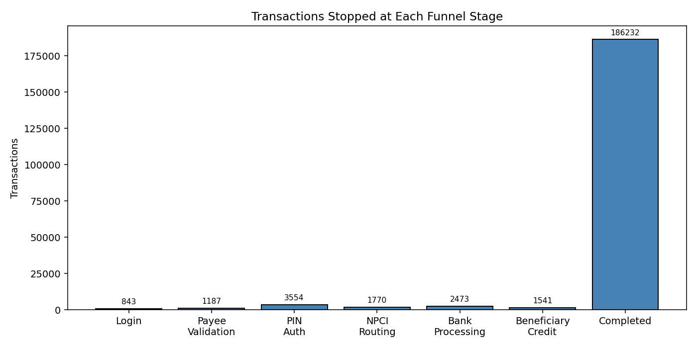
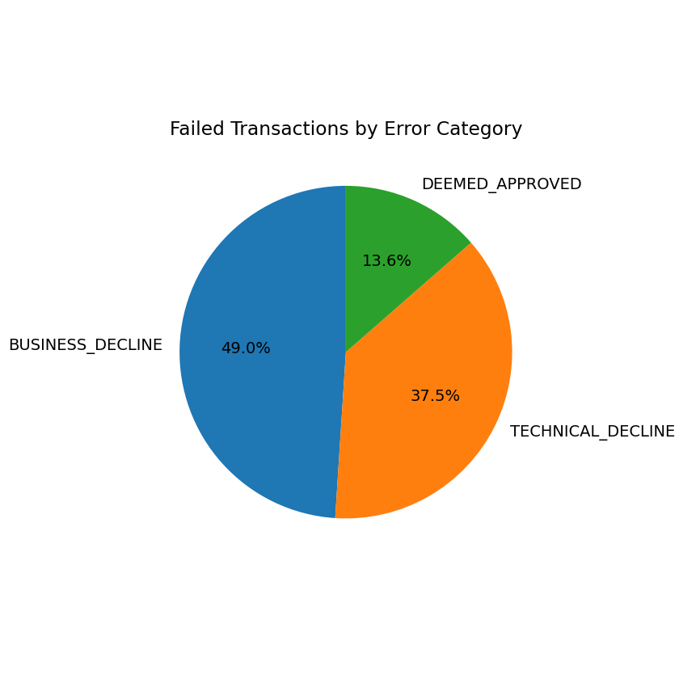
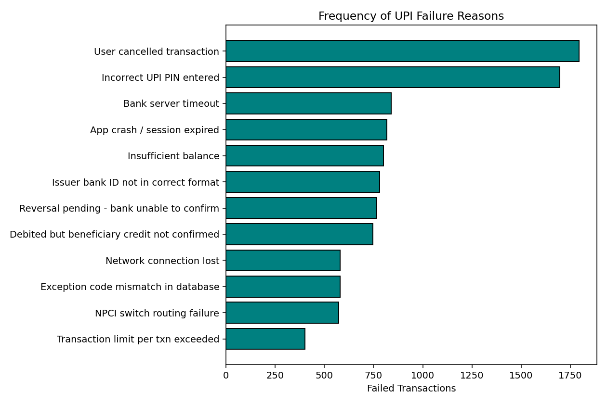
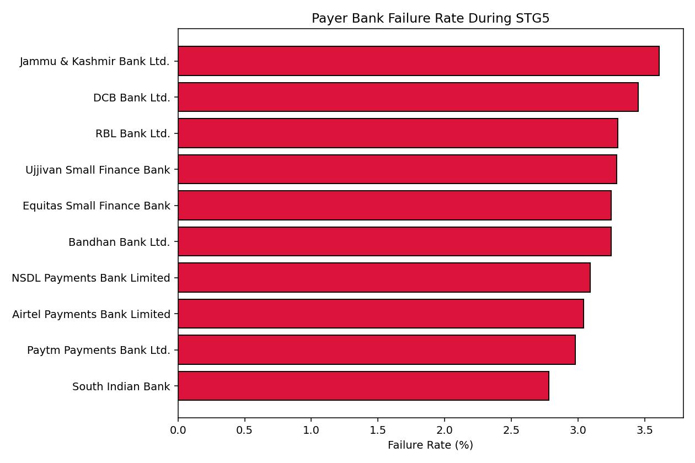
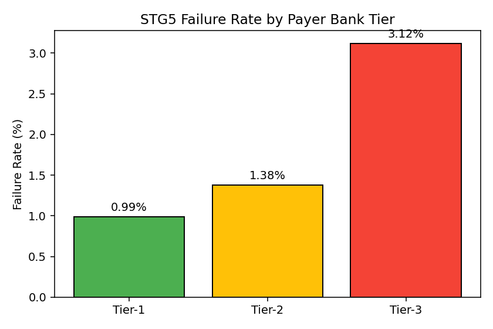
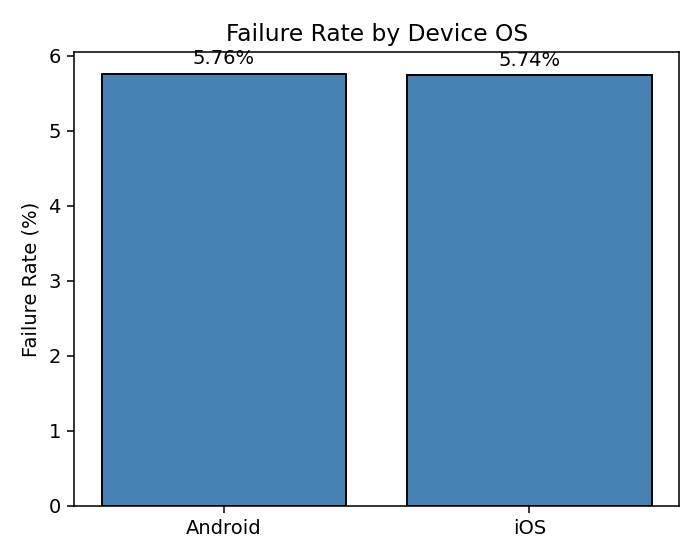
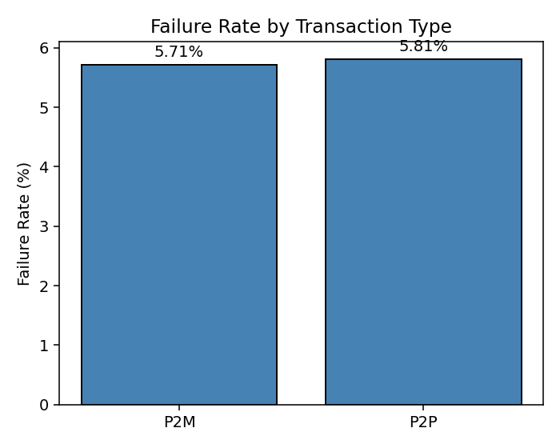

# UPI Transaction Funnel Analysis

- Analyze the UPI payment journey from app start to final transaction completion.
- Identify the exact funnel stages where transactions fail or stop.
- Quantify failure reasons by stage, error category, bank tier, device OS, and transaction type.
- Help app makers decide where to improve user experience, bank reliability, and technical stability.

## Project Context

- UPI transactions pass through multiple stages before completion.
- A failed transaction can happen due to user action, PIN authentication, app issues, bank timeout, routing problems, or reversal delays.
- Funnel analysis helps convert raw transaction events into business insights.
- This analysis covers **197,600 unique transactions**.
- Final success stage is **STG7**.
- Any transaction stopping before STG7 is treated as a drop-off.

## How will this analysis helps stakeholders:

- Shows where users face the most friction.
- Separates user-side failures from technical and bank-side failures.
- Highlights high-risk stages like **STG3 PIN Authentication** and **STG5 Bank Processing**.
- Helps prioritize fixes by impact instead of guessing.
- Supports segment-wise improvements for banks, device OS, and transaction types.

## Transaction Funnel Performance

- Completed till **STG7**: **186,232 transactions**.
- Dropped before **STG7**: **11,368 transactions**.
- Overall completion rate: **94.25%**.
- Overall drop-off rate: **5.75%**.
- Biggest drop stage: **STG3 - UPI PIN Authentication**
  - **3,554 stopped transactions**
  - **31.26%** of all dropped transactions.
- Second biggest drop stage: **STG5 - Issuing Bank Processing**
  - **2,473 stopped transactions**
  - **21.75%** of all dropped transactions.
- STG3 and STG5 together:
  - **6,027 failed transactions**
  - **53.01%** of all drop-offs before STG7.

## Failure Categories

- Total failed transactions: **11,368**.
- Mapped failure categories in the graph: **11,140 failures**.
- **BUSINESS_DECLINE**: **5,456 failures**
  - **47.99%** of all failures.
  - **49.0%** of mapped category failures.
- **TECHNICAL_DECLINE**: **4,173 failures**
  - **36.71%** of all failures.
  - **37.5%** of mapped category failures.
- **DEEMED_APPROVED**: **1,511 failures**
  - **13.29%** of all failures.
  - **13.6%** of mapped category failures.
- Unknown or unmapped failures: **228**
  - **2.01%** of all failures.

## UPI Failure Reasons

- Top failure reason: **User cancelled transaction**
  - **1,795 failures**
  - **15.79%** of all failures.
- Second highest reason: **Incorrect UPI PIN entered**
  - **1,697 failures**
  - **14.93%** of all failures.
- These two user-side issues together:
  - **3,492 failures**
  - **30.72%** of all failures.
- Biggest technical issue: **Bank server timeout**
  - **839 failures**
  - **7.38%** of all failures.
- App/session issue: **App crash / session expired**
  - **818 failures**
  - **7.20%** of all failures.
- Deemed-approved issues:
  - **1,511 failures**
  - **13.29%** of all failures.

## Bank Processing and Bank Tier

- STG5 is the bank processing stage.
- Highest STG5 payer-bank failure rates are from **Tier-3 banks**.
- Top STG5 payer-bank failure rates:
  - **Jammu & Kashmir Bank Ltd.**: **31 / 858**, **3.61%**
  - **DCB Bank Ltd.**: **43 / 1,248**, **3.45%**
  - **RBL Bank Ltd.**: **58 / 1,758**, **3.30%**
  - **Ujjivan Small Finance Bank**: **35 / 1,063**, **3.29%**
  - **Bandhan Bank Ltd.**: **56 / 1,723**, **3.25%**
- STG5 failure rate by payer bank tier:
  - **Tier-1**: **1,250 / 125,877**, **0.99%**
  - **Tier-2**: **625 / 45,221**, **1.38%**
  - **Tier-3**: **598 / 19,148**, **3.12%**
- Tier-3 STG5 failure rate is about **3.15x higher** than Tier-1.

## Device OS Impact

- **Android**: **8,882 / 154,283 failed**, **5.76%**.
- **iOS**: **2,486 / 43,317 failed**, **5.74%**.
- Difference: **0.02 percentage points**.
- Device OS does not show a major failure-rate impact.

## Transaction Type Impact

- **P2P**: **5,158 / 88,785 failed**, **5.81%**.
- **P2M**: **6,210 / 108,815 failed**, **5.71%**.
- Difference: **0.10 percentage points**.
- Transaction type does not show a major failure-rate impact.

## Improvements Required

- Improve **STG3 PIN authentication**.
  - Current issue: **3,554 stopped transactions**.
  - Focus: clearer PIN retry guidance and better user messaging.
- Improve **STG5 bank processing reliability**.
  - Current issue: **2,473 stopped transactions**.
  - Focus: timeout monitoring and faster bank-side escalation.
- Reduce **user-side business declines**.
  - BUSINESS_DECLINE failures: **5,456**.
  - Focus: cancellation analysis, PIN clarity, balance and limit messaging.
- Reduce **technical declines**.
  - TECHNICAL_DECLINE failures: **4,173**.
  - Focus: bank timeout, app crash/session expiry, network recovery.
- Prioritize **Tier-3 bank monitoring** at STG5.
  - Tier-3 STG5 failure rate: **3.12%**.
  - Tier-1 STG5 failure rate: **0.99%**.
- Improve error mapping.
  - Unknown failures: **228**.
  - Goal: make every failure traceable to a clear reason.

## Conclusion

- The UPI funnel is performing well overall with a **94.25% completion rate**.
- The main business problem is the **5.75% drop-off before STG7**.
- Most failures are concentrated in a few clear areas:
  - **STG3 PIN Authentication**: **3,554 stopped transactions**.
  - **STG5 Bank Processing**: **2,473 stopped transactions**.
  - **BUSINESS_DECLINE**: **5,456 failures**.
  - **TECHNICAL_DECLINE**: **4,173 failures**.
- STG3 and STG5 together explain **53.01%** of all drop-offs.
- Device OS and transaction type have very small failure-rate differences.
  - OS difference: **0.02 percentage points**.
  - Transaction type difference: **0.10 percentage points**.
- The highest priority should be improving authentication flow, bank processing reliability, and technical stability.

